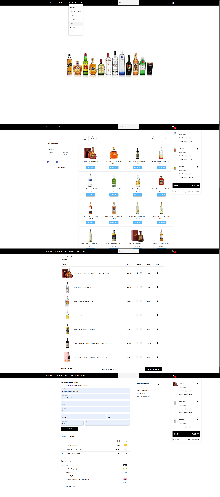

## Source Code

The full source code is maintained in a private repository and can be shared with recruiters or collaborators upon request.

🔗 Live preview: https://darlak.onrender.com

## Preview

## E-commerce_LiquorStore

ASP.NET Core 6.0 + Angular Material 17.3.10

## Overview

> This is a web application built with C# and ASP.NET Core 6.0.
> The project represents a simple online liquor store application.
> The main goal of the project was learning full-stack development and application architecture.

## Tech Stack

### Backend
- ASP.NET Core 6.0
- Entity Framework Core
- Dependency Injection

### Frontend
- Angular 17.3.10
- Angular Material
- NgRx (state management)

## Project Status

This repository contains **only a public project overview**.

> ✅ The full source code is stored in a private repository and is available **on request**.

